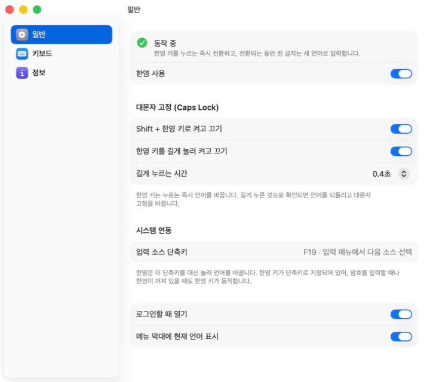
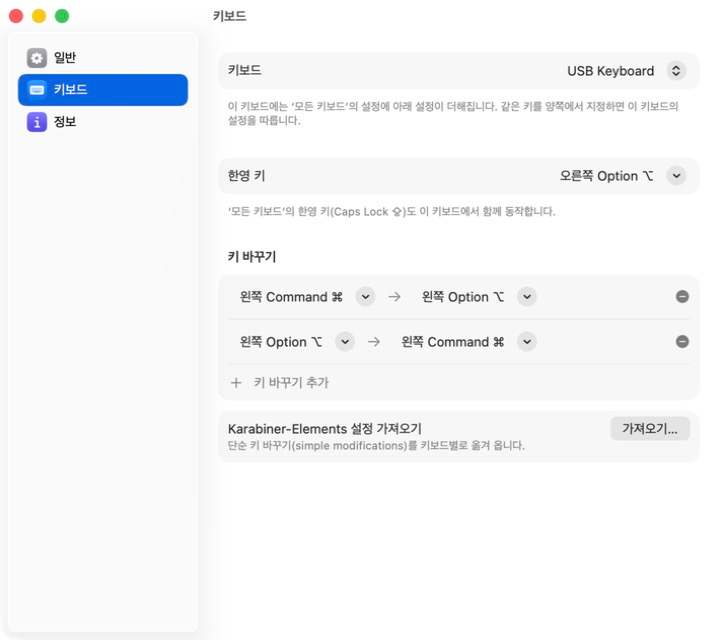

# 한영: 맥 한영 전환 딜레이·씹힘 해결

맥(macOS)에서 Caps Lock으로 한영 전환을 할 때 생기는 딜레이와 씹힘을 없애려고 만든 메뉴 막대 앱입니다. 한영 키를 누르는 즉시 언어를 바꾸고, 전환되는 동안 친 글자를 놓치지 않게 합니다. 키보드별 키 바꾸기도 함께 처리하므로 한영 전환 때문에 카라비너(Karabiner-Elements)를 쓰고 있었다면 대체할 수 있습니다.



## 맥 한영 전환은 왜 느리고 씹히나요?

macOS에서 Caps Lock으로 한영을 전환할 때 생기는 지연과 씹힘에는 원인이 둘 있습니다.

1. **Caps Lock 지연 판정.** macOS는 Caps Lock을 짧게 누르면 전환, 길게 누르면 대문자 고정으로 구분합니다. 그래서 키를 뗄 때 전환하고, 타이핑 직후에 짧게 누른 Caps Lock은 무시하거나 늦게 처리합니다.
2. **입력 소스 전환은 비동기.** 전환 명령이 처리된 뒤 실제로 앱의 입력기가 바뀌기까지 수십 밀리초가 걸리고, 그 사이에 친 글자는 이전 언어로 들어갑니다.

Caps Lock을 F18/F19로 바꾸는 널리 알려진 방법은 1번만 해결합니다. 한영은 둘 다 해결합니다.

- 한영 키를 키보드 드라이버 단계에서 다른 키로 바꿔 지연 판정을 거치지 않게 합니다.
- 키를 누르는 순간 전환을 시작하고, 전환이 확인될 때까지 뒤따르는 키 입력을 붙잡아 두었다가 순서대로 내보냅니다.

이 설명은 Apple의 공식 문서가 아니라 사용자들이 동작을 분석해 정리한 내용에 근거합니다. 2번이 얼마나 자주 나타나는지는 Mac과 쓰는 앱에 따라 다르며, [자체 점검](#개발)으로 직접 재 볼 수 있습니다.

## 기능

- **즉시 전환**: 한영 키를 누르는 순간(떼는 순간이 아니라) 전환합니다.
- **글자 보존**: 전환 직후에 친 글자가 이전 언어로 들어가지 않습니다.
- **대문자 고정**: `Shift + 한영 키`와 한영 키 길게 누르기를 각각 켜고 끌 수 있습니다.
- **키보드별 설정**: 키보드마다 한영 키와 키 바꾸기(예: ⌘↔⌥, 오른쪽 Control → fn)를 따로 지정합니다.
- **Karabiner-Elements 설정 가져오기**: 단순 키 바꾸기(simple modifications)를 키보드별로 옮겨 옵니다.
- **끊기지 않는 동작**: 잠자기에서 깨어날 때, 키보드를 다시 연결할 때 매핑을 다시 적용합니다. 앱이 예기치 않게 종료되면 자동으로 다시 실행합니다.
- **안전한 복구**: 정상 종료하면 키보드를 원래대로 되돌립니다. 반복해서 비정상 종료되면 매핑을 풀고 재실행을 멈춥니다.



## 설치

macOS 14 이상이 필요합니다. 아직 배포용 빌드가 없어 소스에서 직접 빌드합니다. Xcode 없이 Command Line Tools만 있어도 됩니다.

```bash
git clone https://github.com/jihoonkim888/hanyeong.git
cd hanyeong
./scripts/build-app.sh
cp -R dist/Hanyeong.app /Applications/
open /Applications/Hanyeong.app
```

기본 빌드는 임시(ad-hoc) 서명이라, 다시 빌드할 때마다 손쉬운 사용 권한을 다시 허용해야 합니다. 코드 서명 인증서가 있다면 이름을 넘겨 주면 권한이 유지됩니다.

```bash
SIGN_IDENTITY="내 인증서 이름" ./scripts/build-app.sh
```

## 처음 실행할 때

1. **손쉬운 사용 권한을 허용합니다.** 설정 창의 "권한 허용…"을 누르고 시스템 설정 > 개인정보 보호 및 보안 > 손쉬운 사용에서 한영을 켭니다. 한영 키 입력을 받아 처리하는 데 필요합니다. 이 권한으로 하는 일은 [개인정보와 권한](#개인정보와-권한)에 적어 두었습니다.
2. **(권장) 시스템 단축키를 한영 키로 지정합니다.** 시스템 설정 > 키보드 > 키보드 단축키 > 입력 소스에서 "이전 입력 소스 선택"을 누르고 한영 키(기본 Caps Lock)를 누르면 F19로 등록됩니다. 이렇게 해 두면 암호 입력란처럼 앱이 키 입력을 받을 수 없는 곳이나 한영이 꺼져 있을 때도 한영 키가 동작합니다.
3. **Karabiner-Elements를 쓰고 있었다면** 키보드 탭에서 설정을 가져온 뒤 Karabiner를 종료합니다. Karabiner가 키보드를 직접 제어하는 동안에는 한영의 키 바꾸기가 적용되지 않습니다.

## 자주 묻는 질문

### 카라비너로 Caps Lock을 F18이나 F19로 바꿨는데도 딜레이가 남아요

그 방법은 Caps Lock 지연 판정만 없앱니다. 전환 명령이 나간 뒤 입력기가 실제로 바뀌기까지 걸리는 시간은 그대로여서, 그 사이에 친 글자는 여전히 이전 언어로 들어갈 수 있습니다. 한영은 전환이 확인될 때까지 뒤따르는 키 입력을 붙잡아 둡니다.

### 앱 없이 해결할 수는 없나요?

일부는 가능합니다. 터미널에서 `hidutil`로 Caps Lock을 F18이나 F19로 바꾸고 그 키를 입력 소스 단축키로 등록하면 Caps Lock 지연 판정은 피할 수 있습니다. 다만 재시동하거나 키보드를 다시 연결하면 매핑이 풀려서 매번 다시 적용해야 하고, 전환 직후에 친 글자가 이전 언어로 들어가는 문제는 남습니다. 한영은 이 매핑을 자동으로 다시 적용하고 뒤의 문제까지 처리합니다.

### 오른쪽 Command(⌘)나 오른쪽 Option(⌥)을 한영키로 쓸 수 있나요?

네. 키보드 탭에서 한영 키를 Caps Lock, 오른쪽 ⌘, 오른쪽 ⌥, 오른쪽 ⌃, 한/영 키(LANG1) 중에서 고르거나 다른 키로 지정할 수 있습니다. 키보드마다 따로 정할 수도 있습니다. PC용 키보드의 한/영 키는 기종에 따라 LANG1 또는 오른쪽 ⌥로 인식됩니다.

### 대문자 고정(Caps Lock)은 어떻게 쓰나요?

`Shift + 한영 키`를 누르거나 한영 키를 길게 누릅니다. 두 방법은 설정에서 각각 끌 수 있고, 길게 누르는 시간도 바꿀 수 있습니다.

### 어떤 Mac과 macOS에서 쓸 수 있나요?

macOS 14(Sonoma) 이상에서 동작하도록 만들었습니다. 개발과 확인은 macOS 26(Tahoe)의 맥북 내장 키보드에서 했습니다. 외장 키보드는 키보드별 설정까지 지원하지만 아직 여러 기종에서 확인하지는 못했습니다. 문제가 있으면 [이슈](https://github.com/jihoonkim888/hanyeong/issues)로 알려 주세요.

## 개인정보와 권한

한영은 키 입력을 다루는 앱이라, 하는 일과 하지 않는 일을 분명히 적어 둡니다.

- **네트워크에 연결하지 않습니다.** 코드에 네트워크 요청이 없습니다. 업데이트 확인도, 사용 통계 전송도 하지 않습니다.
- **키 입력을 저장하지 않습니다.** 손쉬운 사용 권한은 한영 키를 알아채고, 전환되는 동안 뒤따르는 키 입력을 잠시 붙잡았다가 그대로 내보내는 데만 씁니다. 붙잡은 키는 메모리에만 있다가 전환이 끝나면 바로 내보냅니다.
- **기록에는 동작 정보만 남습니다.** 실행·종료, 권한 상태, 연결된 키보드 이름, 전환에 걸린 시간을 `~/Library/Logs/Hanyeong/hanyeong.log`와 macOS 시스템 로그에 남깁니다. 어떤 키를 눌렀는지는 남기지 않으며, 기록은 Mac 밖으로 나가지 않습니다.
- **설정은 이 Mac에만 저장합니다.**
- **코드가 모두 공개되어 있습니다.** 직접 읽어 보고 빌드할 수 있습니다. 키 입력을 다루는 부분은 [`SwitchEngine.swift`](Sources/Hanyeong/System/SwitchEngine.swift)와 [`SwitchCore.swift`](Sources/HanyeongCore/SwitchCore.swift)입니다.

## 동작 방식

| 단계 | 하는 일 |
|---|---|
| 키 바꾸기 | `hidutil`과 같은 HID `UserKeyMapping` 속성으로 한영 키를 F19로 바꿉니다. 권한이 필요 없고, Caps Lock 지연 판정보다 앞에서 적용됩니다. |
| 전환 | 이벤트 탭이 F19를 받아 시스템의 입력 소스 단축키를 대신 누릅니다. 백그라운드에서 입력 소스를 직접 선택하는 방식은 한글에서 불안정하다고 알려져 있어, 단축키가 꺼져 있을 때만 그 방식을 씁니다. |
| 버퍼링 | 전환을 시작한 순간부터 입력 소스가 실제로 바뀐 것이 확인될 때까지 키 입력을 붙잡았다가 순서대로 내보냅니다. 0.3초 안에 바뀌지 않으면 그대로 내보냅니다. |
| 복구 | 별도의 작은 감시 프로세스가 앱의 비정상 종료를 감지해 다시 실행합니다. |

## 알아 둘 점

- 암호 입력란 등 보안 입력 중에는 macOS가 어떤 앱에도 키 입력을 전달하지 않습니다. 이때는 시스템 단축키가 한영 키(F19)로 지정되어 있어야 한영 키가 동작합니다. 그렇지 않으면 한영 키는 원래 키로 돌아갑니다.
- 시스템 설정 앱이 맨 앞에 있는 동안에는 한영 키를 가로채지 않습니다. 단축키 등록 화면에서 한영 키를 누를 수 있게 하기 위해서입니다.
- 키 바꾸기는 키 하나를 다른 키 하나로 바꾸는 것만 지원합니다. Karabiner의 복합 규칙(complex modifications)은 지원하지 않습니다.
- F19는 한영 신호로 쓰이므로, 실제 F19 키가 있는 키보드에서는 그 키도 한영 키로 동작합니다.
- 입력 소스가 셋 이상이면 최근에 쓴 두 개 사이를 오갑니다.

## 개발

```bash
./scripts/test.sh                                   # 단위 테스트
./scripts/build-app.sh                              # dist/Hanyeong.app 빌드
dist/Hanyeong.app/Contents/MacOS/Hanyeong --preview general   # 샘플 데이터로 설정 창만 보기
swift scripts/make-icon.swift                       # 아이콘 다시 만들기
```

전환 엔진을 실제 한글 입력기로 점검하려면(손쉬운 사용 권한 필요, 한영을 종료한 상태에서):

```bash
open dist/Hanyeong.app --args --selftest ~/Desktop/hanyeong-selftest.txt
```

버퍼링이 없을 때와 있을 때 각각 글자가 올바른 언어로 입력되는지, 전환에 몇 ms가 걸리는지 기록합니다.

코드는 두 부분으로 나뉩니다. `Sources/HanyeongCore`는 전환 상태 기계, 설정 모델, Karabiner 설정 변환처럼 시스템에 의존하지 않는 로직이고 단위 테스트가 있습니다. `Sources/Hanyeong`은 HID 재매핑, 이벤트 탭, 메뉴 막대와 설정 화면입니다.

## 참고한 프로젝트

- [gksdud](https://github.com/codingnoye/gksdud): Karabiner 없이 한영 키를 재매핑하는 접근
- [mackor](https://github.com/ASDFGHoney/mackor): 지연 원인 분석과, 전환이 끝날 때까지 키를 붙잡아 두는 접근

## 라이선스

[MIT](LICENSE)
